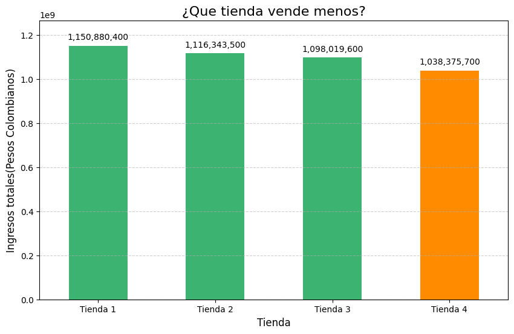

# Challengue Alura Store


Este proyecto tiene como objetivo ayudar a un empresario a decidir que tienda vender para invertir en un nuevo negocio de un total de 4 tiendas.
## 🚀 Instalación y ejecución del proyecto

Para realizar la instalación y ejecución del proyecto se tienen que seguir los siguientes pasos:
1. Clonar el código en Google Colab:
```sh
git clone https://github.com/Omar05129/Alura-Store-Challengue.git
```
2. Luego, abrir el archivo "AluraStoreLatam.ipynb"
3. Para ejecutar el codigo solo ejecuta las lineas que no tengan los comandos git

## 📌 Descripción del Proyecto

Este proyecto consistió en el análisis de datos de 4 tiendas, en el cual se evaluó el desempeño en 5 áreas:
- Facturación total de cada tienda
- Categorias más populares
- Promedio de calificación de los clientes
- Productos más y menos vendidos
- Costo promedio del envio

## ⚙️ Resultados

Algunas gráficas que salieron del analisis son las siguientes:



